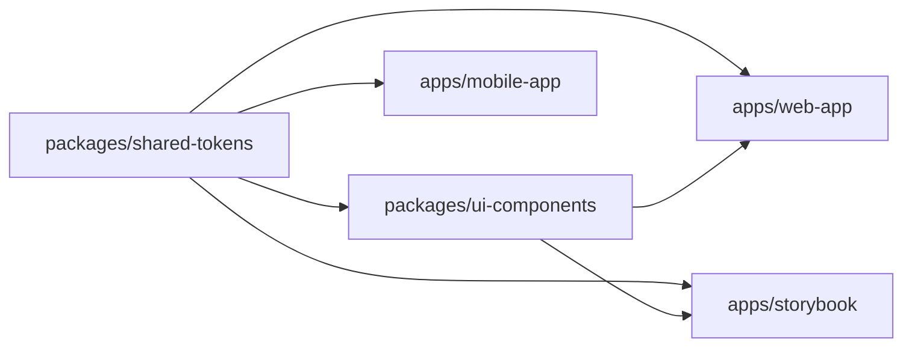

# MTN MoMo4Business Monorepo

A Turborepo-based monorepo for shared design tokens, reusable UI components, web app development, mobile app development, and Storybook.

## Structure

```text
apps/
  web-app/            # Vite + React app
  mobile-app/         # Expo + React Native app
  storybook/          # Storybook workspace for shared components
packages/
  shared-tokens/      # Shared CSS design tokens
  ui-components/      # Shared React component library
```

## Workspace Model

- Root workspaces are declared as `apps/*` and `packages/*` in [package.json](package.json).
- pnpm workspace discovery is defined in [pnpm-workspace.yaml](pnpm-workspace.yaml).
- Shared tokens live in [packages/shared-tokens/package.json](packages/shared-tokens/package.json) and are consumed everywhere through the `@shared/tokens` workspace dependency.
- Shared UI components live in [packages/ui-components/package.json](packages/ui-components/package.json) and also depend on `@shared/tokens`.
- Storybook lives in [apps/storybook/package.json](apps/storybook/package.json) and consumes the shared UI package directly from source.
- Turbo uses topological execution with `dependsOn: ["^build"]`, so shared packages are built before the apps that depend on them.

## How The Pieces Connect



- `packages/shared-tokens` defines the design system primitives as CSS custom properties and Tailwind v4 theme tokens.
- `packages/ui-components` imports those tokens and exports reusable React components like `Card`.
- `apps/web-app` imports the shared token stylesheet and scans `packages/ui-components/src` so Tailwind can compile utility classes used in shared components.
- `apps/storybook` imports the same shared token stylesheet and scans the same component source path so stories render with the same styling and token values as the app.
- `apps/mobile-app` also consumes `@shared/tokens` so the same visual language can be shared with the Expo app.

## Runtime Flow

1. `packages/shared-tokens` provides the base theme values and CSS variables.
2. `packages/ui-components` builds UI on top of those tokens using Tailwind utility classes.
3. `apps/web-app` and `apps/storybook` both import the token CSS entry and explicitly source the shared component folder.
4. Storybook renders the shared component library in isolation for review, while the web app consumes the same components in the product surface.
5. Turbo coordinates the pipeline so package dependencies resolve before app-level tasks run.

## Turbo Tasks

Defined in [turbo.json](turbo.json):

- `build`: cached, topologically ordered
- `lint`: cached, topologically ordered
- `type-check`: cached, topologically ordered
- `dev`: persistent, not cached
- `clean`: not cached

## Commands

From the repo root:

```bash
pnpm install
pnpm build:all
pnpm lint:all
pnpm type-check:all
pnpm dev:all
```

Targeted local development:

```bash
pnpm --filter web-app dev
pnpm --filter mobile-app dev
pnpm --filter storybook dev
```

Storybook runs on http://localhost:6006 and loads stories from `packages/ui-components/src/**/*.stories.@(js|jsx|ts|tsx)`.

## Caching Notes

- Turbo cache keys include `package.json`, `turbo.json`, root `tsconfig.json` (if present), and `.env*`.
- Build outputs cached by default include `dist/**`, `build/**`, and `.next/**` (excluding `.next/cache/**`).

## Per-Package Scripts

Each workspace exposes the standard scripts needed by Turbo:

- `build`
- `lint`
- `type-check`
- `dev` where the workspace is runnable

The shared tokens package is static, while the web app, mobile app, and Storybook workspace are runnable entry points.
